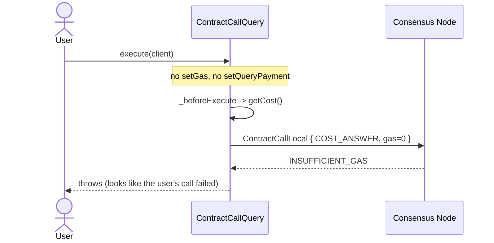
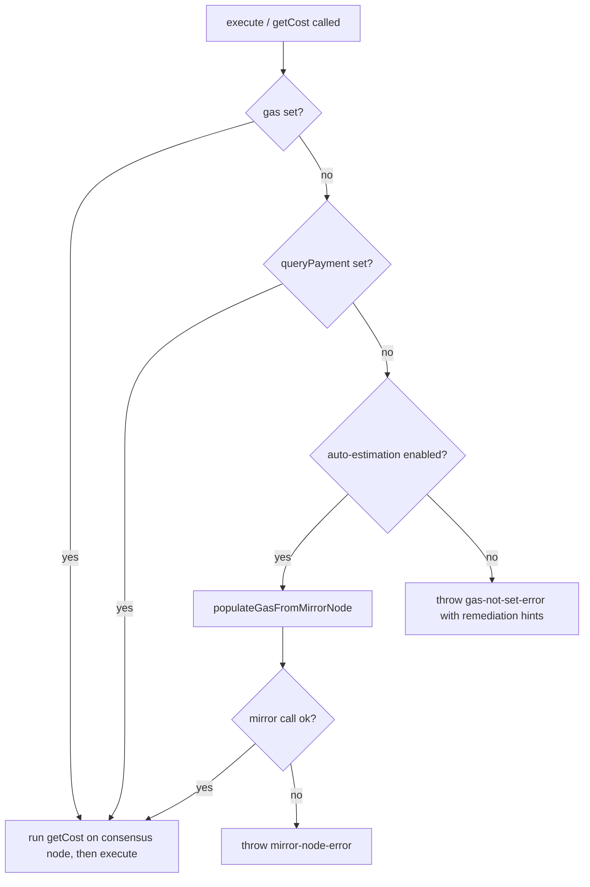
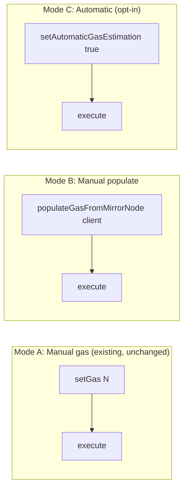

# `ContractCallQuery` Gas and Cost Estimation

**Date Submitted:** 2026-05-11

## Summary

`ContractCallQuery.execute(client)` currently fails with `INSUFFICIENT_GAS`
whenever the caller does not call `setGas(...)` first. The failure is reported
against the user's call, but it actually comes from the SDK's *internal*
`getCost()` pre-step that wraps the user's query in a `CostQuery` and asks the
consensus node to price it. Per `services_contract_call_local.proto`, the node
"SHALL always consume the entire amount of offered gas in determining the fee
for this query, so accurate gas estimation is important" — the cost is defined
as `gas × tinybars-per-gas`. With no gas set, the SDK sends `gas=0` and the
node correctly rejects. The consensus node is behaving per spec; the bug is on
the SDK side. See
[hiero-sdk-js#2848](https://github.com/hiero-ledger/hiero-sdk-js/issues/2848)
and [hiero-consensus-node#4854](https://github.com/hiero-ledger/hiero-consensus-node/issues/4854).



This proposal fixes the bug across all Hiero SDKs by adopting **opt-in
automatic gas estimation with explicit-by-default behavior**. Three new
entry points are added to `ContractCallQuery`:

1. `populateGasFromMirrorNode(client)` — async helper that fills in gas via
   `MirrorNodeContractEstimateQuery`.
2. `setAutomaticGasEstimation(enabled)` / `isAutomaticGasEstimation()` —
   opt-in flag; when `true`, `execute()` and `getCost()` internally call
   `populateGasFromMirrorNode` if gas is null.
3. A behavior change in `execute()` and `getCost()`: when gas is null and
   automatic estimation is disabled, fail fast with a clear `gas-not-set`
   error instead of dispatching a guaranteed-to-fail `COST_ANSWER` request.

The design keeps the existing sync setters sync, isolates the async network
round-trip in an explicitly-async method, and avoids introducing a hidden
Mirror Node dependency on every contract call. Callers who already call
`setGas(...)` see no change.

This proposal scopes the fix to `ContractCallQuery`. Cost-estimation
flakiness reported for other queries (e.g., `AccountRecordsQuery`) has a
different root cause and is out of scope.

---

## New APIs

### `ContractCallQuery` — gas estimation helpers

```
ContractCallQuery {
    // Returns the Mirror Node gas estimate for this query without mutating
    // it. Uses MirrorNodeContractEstimateQuery against the client's mirror
    // network. Does not contact the consensus node.
    @@async
    @@throws(mirror-node-error)
    int64 estimateGasFromMirrorNode(client: Client)

    // Convenience: runs estimateGasFromMirrorNode(client) and stores the
    // result via setGas(...). Returns this for chaining.
    @@async
    @@throws(mirror-node-error)
    ContractCallQuery populateGasFromMirrorNode(client: Client)

    // Opt-in flag. Default: false. When true, execute() and getCost() call
    // populateGasFromMirrorNode(client) internally if gas is null and
    // queryPayment is not set.
    ContractCallQuery setAutomaticGasEstimation(enabled: bool)

    bool isAutomaticGasEstimation()
}
```

Notes:

- `MirrorNodeContractEstimateQuery` is already exposed in the SDKs that have
  shipped it (e.g., hiero-sdk-js, hiero-sdk-java). The helpers above wrap
  that existing functionality so callers do not have to compose it
  themselves.
- The helper methods do not require the query to be frozen. They read the
  query's existing `contractId`, `functionParameters`, and `sender` fields
  exactly as a subsequent `execute(client)` would.
- The `enabled` parameter on `setAutomaticGasEstimation` is non-nullable; the
  flag is a tri-no-state boolean (the default `false` is taken when the
  setter has never been called).

---

## Updated APIs

### `ContractCallQuery` — `execute` and `getCost` behavior

The methods exist already; this proposal updates their pre-execution logic
and throws set. No new fields are added.

```
ContractCallQuery {
    // Behavior when invoked:
    //   - If gas is set: unchanged behavior (proceed with getCost / execute).
    //   - If gas is null and queryPayment is set: unchanged behavior
    //     (getCost is skipped, queryPayment is used directly).
    //   - If gas is null and queryPayment is not set and
    //     isAutomaticGasEstimation() == true:
    //       call populateGasFromMirrorNode(client) internally, then proceed.
    //   - Otherwise: throw gas-not-set-error before any consensus-node call.
    @@async
    @@throws(gas-not-set-error, mirror-node-error, precheck-error)
    ContractFunctionResult execute(client: Client)

    @@async
    @@throws(gas-not-set-error, mirror-node-error)
    Hbar getCost(client: Client)
}
```

---

## Internal Changes

The SDK's per-query pre-execution path (in JS: `Query._beforeExecute`; the
equivalent in each other SDK) must be updated for `ContractCallQuery` to
consult the gas value before constructing the wrapped `CostQuery`:



Implementation guidance:

- The `gas-not-set-error` message must list the three remediation paths:
  call `setGas(...)`, call `populateGasFromMirrorNode(client)`, or call
  `setAutomaticGasEstimation(true)`.
- The Mirror Node call inside the automatic path must respect the client's
  configured Mirror Node endpoints and timeouts. A Mirror Node failure must
  surface as `mirror-node-error`; the SDK must **not** silently fall back to
  a `gas=0` consensus-node call.
- Backwards compatibility: any caller already invoking `setGas(...)` or
  `setQueryPayment(...)` sees no change. Callers who relied on the previous
  silent failure (none expected) will now see a clearer error.
- This proposal does not generalise to other queries. The behavior change
  applies to `ContractCallQuery` only.

### Response Codes

No new consensus-node response codes are introduced. Existing
`INSUFFICIENT_GAS` continues to surface when the caller (or the Mirror Node
estimate) offers gas below the EVM intrinsic floor.

#### Transaction Retry

`gas-not-set-error` is a client-side validation error raised before any
network request. It must not be retried.

`mirror-node-error` from `populateGasFromMirrorNode` follows the SDK's
existing Mirror Node retry policy (transport-level retries are handled
inside the Mirror Node helper; semantic errors propagate to the caller).

---

## Test Plan

1. **Given** a `ContractCallQuery` with `setGas` set to a sufficient value,
   **when** `execute(client)` runs, **then** the call succeeds and returns
   the contract function result.
2. **Given** a `ContractCallQuery` with neither `setGas` nor
   `setQueryPayment` set and `isAutomaticGasEstimation()` is `false`,
   **when** `execute(client)` runs, **then** it throws `gas-not-set-error`
   *before* any consensus-node or Mirror Node request is sent.
3. **Given** a `ContractCallQuery` with `setAutomaticGasEstimation(true)`
   and no `setGas`, **when** `execute(client)` runs, **then** the SDK calls
   `MirrorNodeContractEstimateQuery`, stores the estimate as gas, computes
   the cost via the consensus node, and the call succeeds.
4. **Given** a `ContractCallQuery` and a reachable Mirror Node, **when**
   `populateGasFromMirrorNode(client)` is called, **then** `getGas()` on the
   query returns the Mirror Node estimate and a subsequent `execute(client)`
   (without re-populating) succeeds.
5. **Given** a `ContractCallQuery` with `setAutomaticGasEstimation(true)`
   and a Mirror Node that returns an error, **when** `execute(client)` runs,
   **then** it surfaces `mirror-node-error` and never sends a `gas=0`
   request to the consensus node.
6. **Given** a `ContractCallQuery` with `setQueryPayment` set explicitly and
   no `setGas`, **when** `execute(client)` runs, **then** it throws
   `gas-not-set-error` (the queryPayment covers the SDK's fee for the query,
   but the EVM call itself still needs gas).
7. **Given** a `ContractCallQuery` with `setGas` set below the EVM intrinsic
   floor (e.g., 1000), **when** `execute(client)` runs, **then** the
   consensus node returns `INSUFFICIENT_GAS` (pre-existing behavior,
   unchanged).
8. **Given** any newly constructed `ContractCallQuery`, **when**
   `isAutomaticGasEstimation()` is read without `setAutomaticGasEstimation`
   ever having been called, **then** it returns `false`.

### TCK

The tests above must be ported to the
[hiero-sdk-tck](https://github.com/hiero-ledger/hiero-sdk-tck) repository.
The TCK currently drives SDK servers via JSON-RPC; new RPC methods are
needed for `populateGasFromMirrorNode`, `setAutomaticGasEstimation`, and
`isAutomaticGasEstimation`, plus negative-path scenarios for tests 2, 5, 6,
and 7. A tracking issue should be opened in the TCK repository before
implementation begins and linked here.

---

## SDK Example

The proposal supports three caller-facing modes. Use Mode A (manual gas)
when the caller has an accurate offline estimate, Mode B (manual populate)
when the caller wants explicit control over when the Mirror Node round-trip
happens, and Mode C (automatic) when the caller wants the SDK to handle gas
end-to-end.



### Mode A — Manual gas (existing pattern, unchanged)

```ts
const query = new ContractCallQuery()
  .setContractId(contractId)
  .setFunction("retrieve")
  .setGas(25_000);

const result = await query.execute(client);
```

### Mode B — Manual populate

```ts
const query = new ContractCallQuery()
  .setContractId(contractId)
  .setFunction("retrieve");

await query.populateGasFromMirrorNode(client);
const result = await query.execute(client);
```

### Mode C — Automatic estimation (opt-in)

```ts
const query = new ContractCallQuery()
  .setContractId(contractId)
  .setFunction("retrieve")
  .setAutomaticGasEstimation(true);

const result = await query.execute(client);
```

### Default — clear error

```ts
const query = new ContractCallQuery()
  .setContractId(contractId)
  .setFunction("retrieve");

await query.execute(client);
// throws gas-not-set-error:
//   "ContractCallQuery requires gas to be set. Call setGas(gas),
//    populateGasFromMirrorNode(client), or setAutomaticGasEstimation(true)."
```
