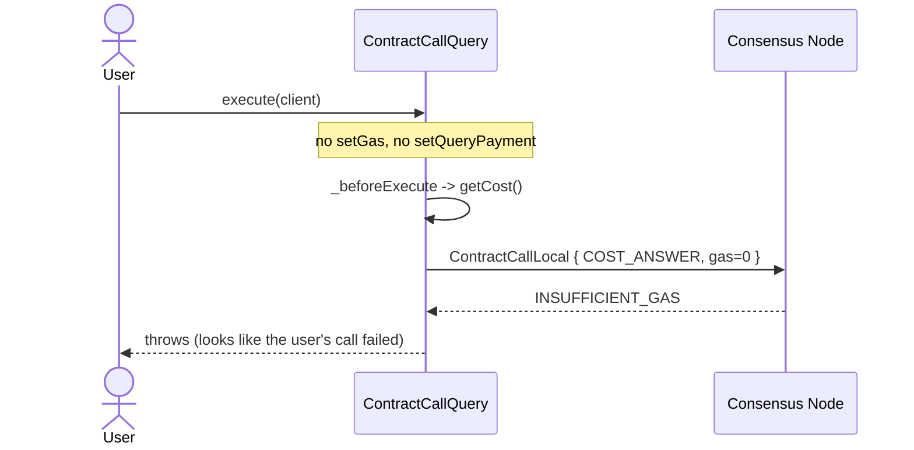
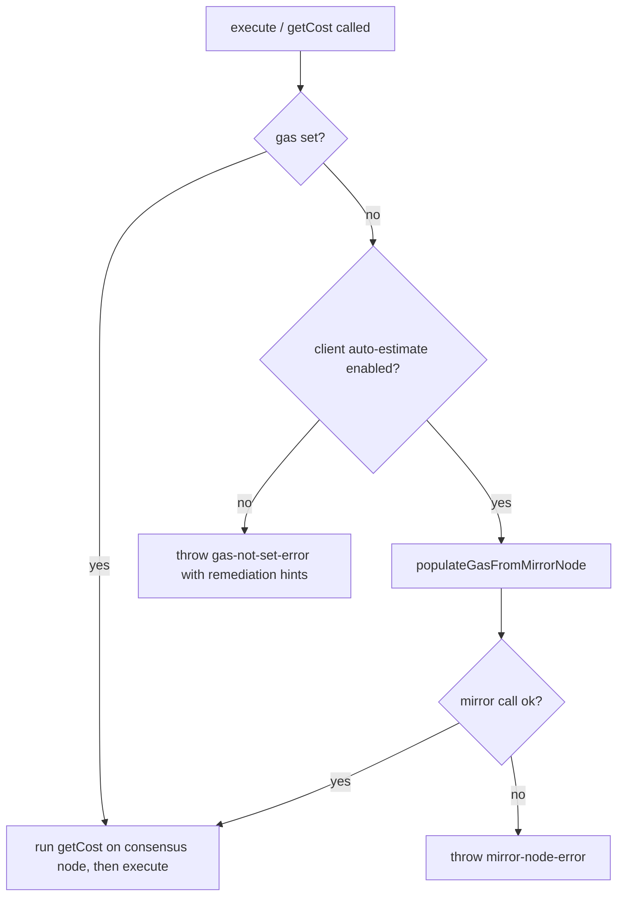

# `ContractCallQuery` Gas and Cost Estimation

**Date Submitted:** 2026-05-11

## Summary

`ContractCallQuery.execute(client)` currently fails with `INSUFFICIENT_GAS`
whenever the caller does not call `setGas(...)` first. The failure is reported
against the user's call, but it actually comes from the SDK's *internal*
`getCost()` pre-step that wraps the user's query in a `CostQuery` and asks the
consensus node to price it. Per `services_contract_call_local.proto`, the node
"SHALL always consume the entire amount of offered gas in determining the fee
for this query, so accurate gas estimation is important" — the cost is defined
as `gas × tinybars-per-gas`. With no gas set, the SDK sends `gas=0` and the
node correctly rejects. The consensus node is behaving per spec; the bug is on
the SDK side. See
[hiero-sdk-js#2848](https://github.com/hiero-ledger/hiero-sdk-js/issues/2848)
and [hiero-consensus-node#4854](https://github.com/hiero-ledger/hiero-consensus-node/issues/4854).



This proposal fixes the bug across all Hiero SDKs with three changes:

1. `ContractCallQuery.populateGasFromMirrorNode(client)` — async helper that
   fills in gas via `MirrorNodeContractEstimateQuery` and stores it on the
   query.
2. `Client.setAutoEstimateContractCallGas(enabled)` /
   `Client.isAutoEstimateContractCallGas()` — a **client-level** opt-in
   flag. When `true`, `ContractCallQuery.execute()` and `getCost()` call
   `populateGasFromMirrorNode(client)` internally if gas is null. The flag
   lives on the client because auto-estimation is a property of how the
   client handles contract reads, not of any one query — this matches how
   relay-style auto-estimation works in practice.
3. A behavior change in `ContractCallQuery.execute()` and `getCost()`:
   when gas is null and the client flag is disabled, fail fast with a
   clear `gas-not-set-error` instead of dispatching a guaranteed-to-fail
   `COST_ANSWER` request.

The design keeps the existing sync setters sync, isolates the async network
round-trip in an explicitly-async method, and avoids introducing a hidden
Mirror Node dependency on every contract call unless the caller opts in at
the client level. Callers who already call `setGas(...)` see no change.

This proposal scopes the fix to `ContractCallQuery`. Cost-estimation
flakiness reported for other queries (e.g., `AccountRecordsQuery`) has a
different root cause and is out of scope.

---

## Rationale — Why not just require `setGas()`?

The natural pushback is "just tell callers to call `setGas(...)` like every
other chain." This section explains why the proposal goes further and adds
auto-estimation.

1. **`ContractCallQuery` is a read query, and EVM read calls do not take
   caller gas.** ethers.js `staticCall`, viem `readContract`, and web3.js
   `.call()` all execute reads without a user-supplied gas value. Gas is
   required by Hedera here only because of how `COST_ANSWER` is priced
   (`gas × tinybars-per-gas`), not because the EVM semantically needs it
   from the caller for a local call. Asking EVM developers to supply gas
   for a read is a Hedera-specific quirk, not an ecosystem norm.
2. **The Hedera JSON-RPC relay already auto-estimates** for `eth_call`.
   This is why contracts that work through the relay (and on Hashscan)
   fail when the same call is issued through the native SDK. The native
   SDKs are diverging from their own relay. Putting the toggle on the
   client matches where this behavior naturally lives: an application
   decides once, at client-configuration time, that its contract reads
   should behave like relay reads.
3. **Mode A (manual gas) is unchanged.** Callers who already do offline
   gas estimation see no behavioural change and pay no overhead. The new
   helper and client flag are strictly additive.

### Why the flag is on the `Client`, not the query

Auto-estimation is a set-and-forget decision about how this application
talks to contracts, not a per-call choice. Putting it on every query would
either force callers to repeat the toggle at every call site or push them
to wrap `ContractCallQuery` in a helper. A single client-level toggle
matches the relay model and keeps the query API minimal.

---

## New APIs

### `ContractCallQuery` — gas estimation helper

```
ContractCallQuery {
    // Runs MirrorNodeContractEstimateQuery against the client's mirror
    // network using this query's existing contractId, functionParameters,
    // and sender, and stores the result via setGas(...). Returns this for
    // chaining. Does not contact the consensus node.
    @@async
    @@throws(mirror-node-error)
    ContractCallQuery populateGasFromMirrorNode(client: Client)
}
```

### `Client` — auto-estimation flag

```
Client {
    // Opt-in flag. Default: false. When true, ContractCallQuery.execute()
    // and ContractCallQuery.getCost() call populateGasFromMirrorNode(this)
    // internally if the query's gas is null.
    Client setAutoEstimateContractCallGas(enabled: bool)

    bool isAutoEstimateContractCallGas()
}
```

Notes:

- `MirrorNodeContractEstimateQuery` is already exposed in the SDKs that have
  shipped it (e.g., hiero-sdk-js, hiero-sdk-java). The helper above wraps
  that existing functionality so callers do not have to compose it
  themselves.
- Callers who want the raw estimate without storing it (e.g., to apply a
  safety multiplier before calling `setGas`) can use
  `MirrorNodeContractEstimateQuery` directly. A second wrapper on
  `ContractCallQuery` for that use case is intentionally omitted to keep
  the API surface small.
- The helper does not require the query to be frozen. It reads the query's
  existing `contractId`, `functionParameters`, and `sender` fields exactly
  as a subsequent `execute(client)` would.
- The `enabled` parameter on `setAutoEstimateContractCallGas` is
  non-nullable. The flag defaults to `false` (i.e. when
  `setAutoEstimateContractCallGas(...)` has never been called).

---

## Updated APIs

### `ContractCallQuery` — `execute` and `getCost` behavior

The methods exist already; this proposal updates their pre-execution logic
and throws set. No new fields are added.

```
ContractCallQuery {
    // Behavior when invoked:
    //   - If gas is set: unchanged behavior (proceed with getCost / execute).
    //   - If gas is null and client.isAutoEstimateContractCallGas() == true:
    //       call populateGasFromMirrorNode(client) internally, then proceed.
    //   - If gas is null and client.isAutoEstimateContractCallGas() == false:
    //       throw gas-not-set-error before any consensus-node or Mirror
    //       Node call. This applies regardless of whether queryPayment is
    //       set.
    @@async
    @@throws(gas-not-set-error, mirror-node-error, precheck-error)
    ContractFunctionResult execute(client: Client)

    @@async
    @@throws(gas-not-set-error, mirror-node-error)
    Hbar getCost(client: Client)
}
```

A null gas value never reaches the wire under this proposal. Even if
`queryPayment` is explicitly set, the EVM call itself still needs a
non-null gas value, so the SDK rejects the call at the client side rather
than dispatching an `ANSWER_ONLY` request with `gas=0`.

---

## Internal Changes

The SDK's per-query pre-execution path (in JS: `Query._beforeExecute`; the
equivalent in each other SDK) must be updated for `ContractCallQuery` to
consult the gas value and the client flag before constructing the wrapped
`CostQuery`:



Implementation guidance:

- The `gas-not-set-error` message must list the three remediation paths:
  call `setGas(...)`, call `populateGasFromMirrorNode(client)`, or call
  `client.setAutoEstimateContractCallGas(true)`.
- The Mirror Node call inside the automatic path must respect the client's
  configured Mirror Node endpoints and timeouts. A Mirror Node failure must
  surface as `mirror-node-error`; the SDK must **not** silently fall back
  to a `gas=0` consensus-node call.
- Backwards compatibility: any caller already invoking `setGas(...)` sees
  no change. Callers who relied on the previous silent failure (none
  expected) will now see a clearer error. Callers who set `queryPayment`
  but not `setGas` previously got `INSUFFICIENT_GAS` from the consensus
  node and will now get `gas-not-set-error` from the SDK before any
  network call (unless the client flag is enabled).
- This proposal does not generalise to other queries. The behavior change
  applies to `ContractCallQuery` only. The client flag is named
  specifically (`AutoEstimateContractCallGas`) to leave room for
  per-query-type toggles in the future without ambiguity.

### Response Codes

No new consensus-node response codes are introduced. Existing
`INSUFFICIENT_GAS` continues to surface when the caller (or the Mirror Node
estimate) offers gas below the EVM intrinsic floor.

#### Transaction Retry

`gas-not-set-error` is a client-side validation error raised before any
network request. It must not be retried.

`mirror-node-error` from `populateGasFromMirrorNode` follows the SDK's
existing Mirror Node retry policy (transport-level retries are handled
inside the Mirror Node helper; semantic errors propagate to the caller).

---

## Test Plan

1. **Given** a `ContractCallQuery` with `setGas` set to a sufficient value,
   **when** `execute(client)` runs, **then** the call succeeds and returns
   the contract function result.
2. **Given** a `ContractCallQuery` with no `setGas` and a client where
   `isAutoEstimateContractCallGas()` is `false`, **when** `execute(client)`
   runs, **then** it throws `gas-not-set-error` *before* any
   consensus-node or Mirror Node request is sent.
3. **Given** a `ContractCallQuery` with no `setGas` and a client where
   `setAutoEstimateContractCallGas(true)` has been called, **when**
   `execute(client)` runs, **then** the SDK calls
   `MirrorNodeContractEstimateQuery`, stores the estimate as gas, computes
   the cost via the consensus node, and the call succeeds.
4. **Given** a `ContractCallQuery` and a reachable Mirror Node, **when**
   `populateGasFromMirrorNode(client)` is called, **then** `getGas()` on
   the query returns the Mirror Node estimate and a subsequent
   `execute(client)` succeeds.
5. **Given** a `ContractCallQuery` with no `setGas` and a client where
   `setAutoEstimateContractCallGas(true)` has been called, and a Mirror
   Node that returns an error, **when** `execute(client)` runs, **then**
   it surfaces `mirror-node-error` and never sends a `gas=0` request to
   the consensus node.
6. **Given** a `ContractCallQuery` with `setQueryPayment` set explicitly
   and no `setGas`, and a client where `isAutoEstimateContractCallGas()`
   is `false`, **when** `execute(client)` runs, **then** it throws
   `gas-not-set-error` before any network call.
7. **Given** a `ContractCallQuery` with `setGas` set below the EVM
   intrinsic floor (e.g., 1000), **when** `execute(client)` runs, **then**
   the consensus node returns `INSUFFICIENT_GAS` (pre-existing behavior,
   unchanged).
8. **Given** a freshly constructed `Client`, **when**
   `isAutoEstimateContractCallGas()` is read without
   `setAutoEstimateContractCallGas(...)` ever having been called, **then**
   it returns `false`.

### TCK

The tests above must be ported to the
[hiero-sdk-tck](https://github.com/hiero-ledger/hiero-sdk-tck) repository.
The TCK currently drives SDK servers via JSON-RPC; new RPC methods are
needed for `populateGasFromMirrorNode`, `setAutoEstimateContractCallGas`,
and `isAutoEstimateContractCallGas`, plus negative-path scenarios for
tests 2, 5, 6, and 7. A tracking issue should be opened in the TCK
repository before implementation begins and linked here.

---

## SDK Example

The proposal supports three caller-facing modes. Use Mode A (manual gas)
when the caller has an accurate offline estimate, Mode B (manual populate)
when the caller wants explicit control over when the Mirror Node round-trip
happens, and Mode C (client-level automatic) when the application wants
all `ContractCallQuery` executions on a given client to estimate gas
end-to-end.

### Mode A — Manual gas (existing pattern, unchanged)

```ts
const query = new ContractCallQuery()
  .setContractId(contractId)
  .setFunction("retrieve")
  .setGas(25_000);

const result = await query.execute(client);
```

### Mode B — Manual populate

```ts
const query = new ContractCallQuery()
  .setContractId(contractId)
  .setFunction("retrieve");

await query.populateGasFromMirrorNode(client);
const result = await query.execute(client);
```

### Mode C — Client-level automatic estimation (opt-in)

```ts
client.setAutoEstimateContractCallGas(true);

// Every ContractCallQuery executed against this client now auto-estimates
// gas via the Mirror Node when setGas was not called.
const query = new ContractCallQuery()
  .setContractId(contractId)
  .setFunction("retrieve");

const result = await query.execute(client);
```

### Default — clear error

```ts
const query = new ContractCallQuery()
  .setContractId(contractId)
  .setFunction("retrieve");

await query.execute(client);
// throws gas-not-set-error:
//   "ContractCallQuery requires gas to be set. Call setGas(gas),
//    populateGasFromMirrorNode(client), or
//    client.setAutoEstimateContractCallGas(true)."
```
